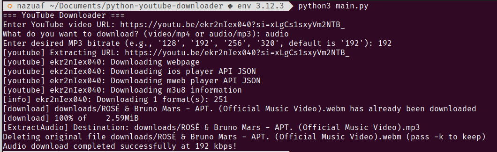

# YouTube Downloader

This is a simple YouTube downloader script that allows you to download videos and extract audio from YouTube videos using `yt-dlp`.

## Requirements
- ffmpeg package ( 
    example in ubuntu or debian base:
        - sudo apt-get update
        - sudo apt-get install ffmpeg
    )

- Python 3.x
- `yt-dlp` library

## Installation

1. Clone the repository or download the script.
2. Install the required dependencies using `pip`:

    ```sh
    recomend to create environment before...
    pip install -r requirements.txt
    ```

## Usage

Run the script using Python:

```sh
python main.py
```

## Source

Another use case you can you can see from source:
https://github.com/yt-dlp/yt-dlp

## Usecase

